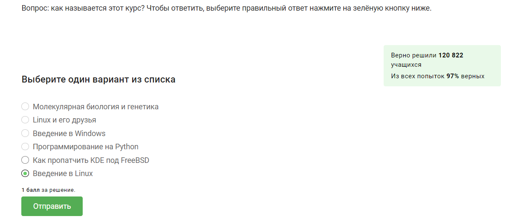
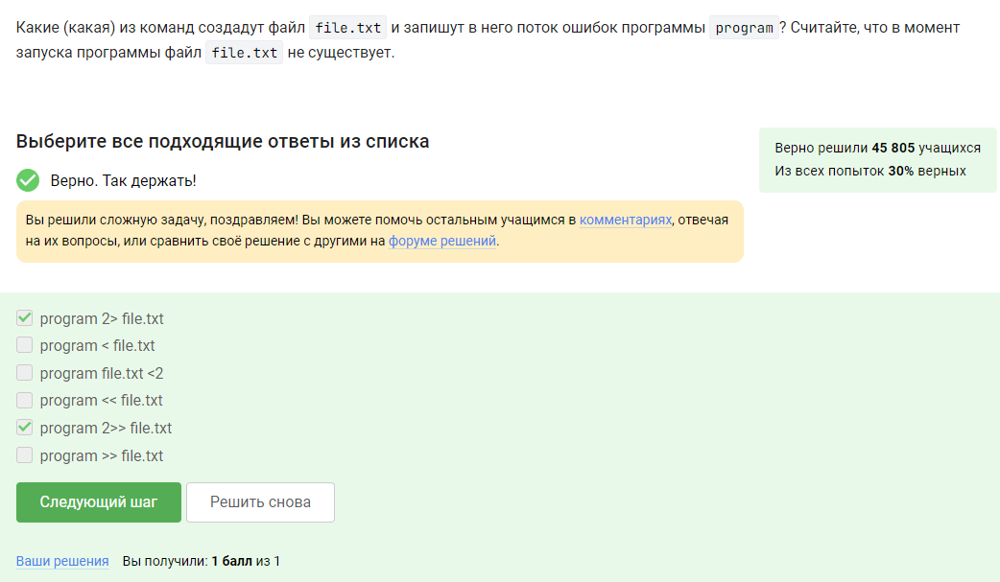
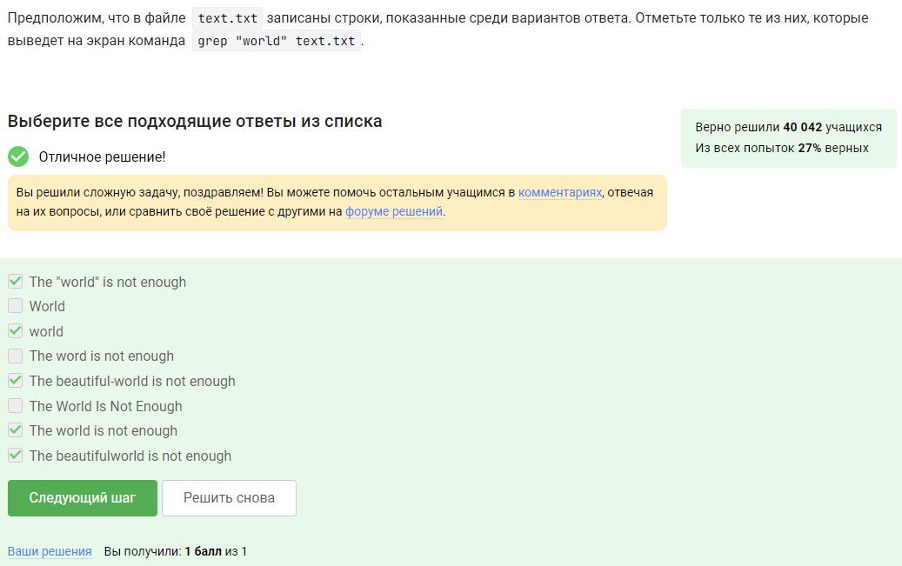

---
## Front matter
title: "Отчёт по выполнению 1 этапа внешнего курса"
subtitle: "Операционные системы"
author: "Бережной Иван Александрович"

## Generic otions
lang: ru-RU
toc-title: "Содержание"

## Bibliography
bibliography: bib/cite.bib
csl: pandoc/csl/gost-r-7-0-5-2008-numeric.csl

## Pdf output format
toc: true # Table of contents
toc-depth: 2
lof: true # List of figures
lot: true # List of tables
fontsize: 13pt
linestretch: 1.5
papersize: a4
documentclass: scrreprt
## I18n polyglossia
polyglossia-lang:
  name: russian
  options:
	- spelling=modern
	- babelshorthands=true
polyglossia-otherlangs:
  name: english
## I18n babel
babel-lang: russian
babel-otherlangs: english
## Fonts
mainfont: PT Serif
romanfont: PT Serif
sansfont: PT Sans
monofont: PT Mono
mainfontoptions: Ligatures=TeX
romanfontoptions: Ligatures=TeX
sansfontoptions: Ligatures=TeX,Scale=MatchLowercase
monofontoptions: Scale=MatchLowercase,Scale=0.9
## Biblatex
biblatex: true
biblio-style: "gost-numeric"
biblatexoptions:
  - parentracker=true
  - backend=biber
  - hyperref=auto
  - language=auto
  - autolang=other*
  - citestyle=gost-numeric
## Pandoc-crossref LaTeX customization
figureTitle: "Рис."
tableTitle: "Таблица"
listingTitle: "Листинг"
lofTitle: "Список иллюстраций"
lotTitle: "Список таблиц"
lolTitle: "Листинги"
## Misc options
indent: true
header-includes:
  - \usepackage{indentfirst}
  - \usepackage{float} # keep figures where there are in the text
  - \floatplacement{figure}{H} # keep figures where there are in the text
---

# Цель работы

Научиться работать с операционной системой Linux

# Задание

Выполнить тестовые задания на основе теории

# Выполнение работы

Выполняем первый этап: (рис. [-@fig:001], [-@fig:002], [-@fig:003], [-@fig:004], [-@fig:005], [-@fig:006], [-@fig:007], [-@fig:008], [-@fig:009], [-@fig:010], [-@fig:011], [-@fig:012], [-@fig:013], [-@fig:014], [-@fig:015], [-@fig:016], [-@fig:017], [-@fig:018], [-@fig:019], [-@fig:020], [-@fig:021], [-@fig:022], [-@fig:023], [-@fig:024], [-@fig:025], [-@fig:026], [-@fig:027], [-@fig:028]).

Пишем название курса.

{#fig:001 width=70%}

Выбираем ответы на основе критериев курса.

{#fig:002 width=70%}

Выбираю то, что использую лично я.

{#fig:003 width=70%}

Выбираем правильное определение виртуальной машины.

{#fig:004 width=70%}

Sir, yes, sir!

{#fig:005 width=70%}

Создаём документ, пишем указанный текст и выбираем нужный формат при сохранении.

{#fig:006 width=70%}

deb.

{#fig:007 width=70%}

Установим плеер через терминал, запустим его и откроем About, где и найдём фамилию первого автора.

{#fig:008 width=70%}

Менеджер обновлений — это программа для обновления установленного программного обеспечения в дистрибутивах ОС Linux, основанных на Debian или использующих систему управления пакетами APT. Менеджер обновлений устанавливает обновления безопасности или просто улучшающие функциональность программы.

{#fig:009 width=70%}

Термин слова термин - Слово или словосочетание, являющееся названием определённого понятия какой-н. специальной области науки, техники, искусства.
Ассоль Васильева - предприниматель.

{#fig:010 width=70%}

Регистр имеет значение. Правильно только `pwd`.

{#fig:011 width=70%}

Нет ключа `--list`, а в последнем варианте отсутствует `-`.

{#fig:012 width=70%}

Последняя команда выведет все файлы и директории, начинающиеся на `Do`, поэтому этот вариант нам не подойдёт.

{#fig:013 width=70%}

`rm -r` удаляет директории и файлы, находящихся в ней.

{#fig:014 width=70%}

Проверили в терминале.

{#fig:015 width=70%}

Скачаем файл, сделаем его исполняемым с помощью команды `chmod +x file.name` и скопируем вывод.

{#fig:016 width=70%}

Мы часто можем видеть вывод ошибок на экран в ходе выполнения лабораторных работ (этой работы в том числе).

{#fig:017 width=70%}

`2> file` — направляет стандартный поток ошибок в файл. Если файл не существует, он будет создан, если существует — перезаписан сверху.  
`2>> file` — направляет стандартный поток ошибок в файл. Если файл не существует, он будет создан, если существует — данные будут дописаны к нему в конец.

{#fig:018 width=70%}

Воспользуемся подсказкой и смоделируем ситуацию. Получили вывод ошибки на экран.

{#fig:019 width=70%}

`-P /home/alex/Pictures` — указывает, что директория для сохранения файлов по умолчанию должна быть `/home/alex/Pictures`. Однако, в данном случае, этот параметр не имеет эффекта из-за использования параметра `-O`.  
`-O 1.jpg` — указывает имя файла, под которым будет сохранен скачанный файл. Важно отметить, что если используется `-O`, указание пути через `-P` игнорируется, и файл будет сохранен в текущей рабочей директории под именем `1.jpg`.  
`http://example.com/example.jpg` — URL-адрес изображения, которое нужно скачать.

{#fig:020 width=70%}

Нужно просто знать ключ.

{#fig:021 width=70%}

При включенной опции `-A jpg` команда `wget` будет скачивать только файлы с расширением `.jpg`. Однако, если также указана опция -r для рекурсивного скачивания, `wget` будет обходить ссылки на другие страницы и скачивать их, даже если они не соответствуют фильтру. Поскольку указано, что "все html будут удалены", это означает, что загруженные html-файлы будут удалены после загрузки.

{#fig:022 width=70%}

Выбираем отличие способов архивации.

{#fig:023 width=70%}

Выбираем нужные способы архивации.

{#fig:024 width=70%}

`c` - архиватор
`j` - указатель на тип архиватора bzip
`f` - потому что создаем архив в файловой системе

{#fig:025 width=70%}

`*.jpg` — найдет все файлы с расширением `.jpg`, но не файл `Alexey.jpeg`, так как его расширение не совпадает.  
`alexey.*` — не найдет `Alexey.jpeg`, так как регистр символов в имени учитывается.
`*.?` — это маска, которая найдет все файлы с расширением из одного символа, включая `Alexey.jpeg`.

{#fig:026 width=70%}

Выведутся все строки, содержащие последовательность символов `world`

{#fig:027 width=70%}

Скачиваем и распаковываем архив, затем, используя команду `grep -r "love" Shakespeare > love_lines.txt` создаём файл `love_lines.txt`, в котором будут содержатся строки, имеющие последовательность символов `love`.

{#fig:028 width=70%}

# Выводы

В ходе выполнения работы мы просмотрели курс и узнали/вспомнили возможности операционной системы Linux

# Список литературы{.unnumbered}

::: Stepik
