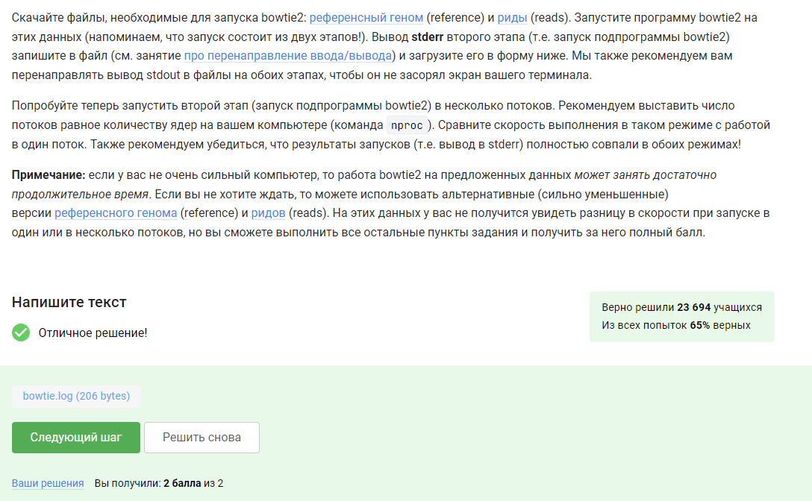

---
## Front matter
title: "Отчёт по выполнению 2 этапа внешнего курса"
subtitle: "Операционные системы"
author: "Бережной Иван Александрович"

## Generic otions
lang: ru-RU
toc-title: "Содержание"

## Bibliography
bibliography: bib/cite.bib
csl: pandoc/csl/gost-r-7-0-5-2008-numeric.csl

## Pdf output format
toc: true # Table of contents
toc-depth: 2
lof: true # List of figures
lot: true # List of tables
fontsize: 13pt
linestretch: 1.5
papersize: a4
documentclass: scrreprt
## I18n polyglossia
polyglossia-lang:
  name: russian
  options:
	- spelling=modern
	- babelshorthands=true
polyglossia-otherlangs:
  name: english
## I18n babel
babel-lang: russian
babel-otherlangs: english
## Fonts
mainfont: PT Serif
romanfont: PT Serif
sansfont: PT Sans
monofont: PT Mono
mainfontoptions: Ligatures=TeX
romanfontoptions: Ligatures=TeX
sansfontoptions: Ligatures=TeX,Scale=MatchLowercase
monofontoptions: Scale=MatchLowercase,Scale=0.9
## Biblatex
biblatex: true
biblio-style: "gost-numeric"
biblatexoptions:
  - parentracker=true
  - backend=biber
  - hyperref=auto
  - language=auto
  - autolang=other*
  - citestyle=gost-numeric
## Pandoc-crossref LaTeX customization
figureTitle: "Рис."
tableTitle: "Таблица"
listingTitle: "Листинг"
lofTitle: "Список иллюстраций"
lotTitle: "Список таблиц"
lolTitle: "Листинги"
## Misc options
indent: true
header-includes:
  - \usepackage{indentfirst}
  - \usepackage{float} # keep figures where there are in the text
  - \floatplacement{figure}{H} # keep figures where there are in the text
---

# Цель работы

Научиться работать с операционной системой Linux

# Задание

Выполнить тестовые задания на основе теории

# Выполнение работы

Выполняем второй этап: (рис. [-@fig:001], [-@fig:002], [-@fig:003], [-@fig:004], [-@fig:005], [-@fig:006], [-@fig:007], [-@fig:008], [-@fig:009], [-@fig:010], [-@fig:011], [-@fig:012], [-@fig:013], [-@fig:014], [-@fig:015], [-@fig:016], [-@fig:017], [-@fig:018], [-@fig:019], [-@fig:020], [-@fig:021], [-@fig:022], [-@fig:023], [-@fig:024]).

Удаленный сервер — это программный веб-сервер, к которому можно получить доступ через интернет.

{#fig:001 width=70%}

Расширение `.pub` указывает на то, что ключ - публичный, а значит его можно свободно пересылать.

{#fig:002 width=70%}

`scp -r`.

{#fig:003 width=70%}

Сначала можем проверить интернет соединение, затем обновляем базу данных.

{#fig:004 width=70%}

FileZilla — это бесплатный, открытый FTP-клиент и сервер. Основные функции: поддержка FTP, SFTP и FTPS, многоязычный интерфейс, возобновление прерванных передач, менеджер сайтов, фильтры имен файлов, поддержка IPv6, Drag and Drop, установка и настройка FTP/FTPS-сервера, управление пользователями и правами доступа, мониторинг подключений, логирование.

{#fig:005 width=70%}

Выбираем то, что действительно поможет в решении проблемы.

{#fig:006 width=70%}

Проверим каждую команду и выберем ответ.

{#fig:007 width=70%}

Посмотрим в справку и выберем верные варианты ответа.

{#fig:008 width=70%}

Также заходим в справку и ищем команду, соответствующую условию.

{#fig:009 width=70%}

Комбинация Ctrl+С - завершает процесс. Комбинация Ctrl+Z - его приостанавливает.

{#fig:010 width=70%}

`jobs`  просто показывает запущенные проги пронумеровав их 1,2,3... А `top` и `ps`, показывает все процессы с их уникальным номером

{#fig:011 width=70%}

Проверим каждую команду и выберем верную.

{#fig:012 width=70%}

Тестируя команду, можно найти ответ на вопрос.

{#fig:013 width=70%}

Остановленное приложение не нагружает процессор.

{#fig:014 width=70%}

Остановленное приложение не закрывается, значит остаётся в памяти в том же объёме.

{#fig:015 width=70%}

Можно завершить разом только все потоки, но не по-отдельности.

{#fig:016 width=70%}

Изучив справочную информацию, мы понимаем, что ответ: bowtie2.

{#fig:017 width=70%}

Скачиваем файлы и запускаем программу bowtie2 на этих данных. Теперь запишем вывод stderr второго этапа в файл.

{#fig:018 width=70%}

Команда fg работает только с запущенным процессом, поэтому терминал нас не поймёт.

{#fig:019 width=70%}

Конечно, tmux завершит работу.

{#fig:020 width=70%}

Моделируем ситуацию и на основе результата выбираем ответ.

{#fig:021 width=70%}

Произойдёт закрытие вкладки и завершение процесса.

{#fig:022 width=70%}

Можем методом проверки каждой команды, а можем через справку.

{#fig:023 width=70%}

Проверяем каждый пункт.

{#fig:024 width=70%}

# Выводы

В ходе выполнения работы мы просмотрели курс и узнали/вспомнили возможности операционной системы Linux

# Список литературы{.unnumbered}

::: Stepik
