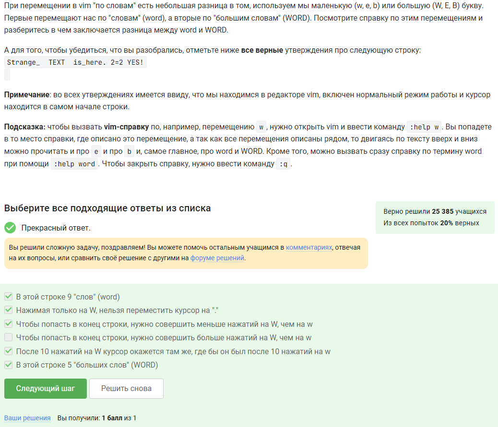

---
## Front matter
title: "Отчёт по выполнению 3 этапа внешнего курса"
subtitle: "Операционные системы"
author: "Бережной Иван Александрович"

## Generic otions
lang: ru-RU
toc-title: "Содержание"

## Bibliography
bibliography: bib/cite.bib
csl: pandoc/csl/gost-r-7-0-5-2008-numeric.csl

## Pdf output format
toc: true # Table of contents
toc-depth: 2
lof: true # List of figures
lot: true # List of tables
fontsize: 13pt
linestretch: 1.5
papersize: a4
documentclass: scrreprt
## I18n polyglossia
polyglossia-lang:
  name: russian
  options:
	- spelling=modern
	- babelshorthands=true
polyglossia-otherlangs:
  name: english
## I18n babel
babel-lang: russian
babel-otherlangs: english
## Fonts
mainfont: PT Serif
romanfont: PT Serif
sansfont: PT Sans
monofont: PT Mono
mainfontoptions: Ligatures=TeX
romanfontoptions: Ligatures=TeX
sansfontoptions: Ligatures=TeX,Scale=MatchLowercase
monofontoptions: Scale=MatchLowercase,Scale=0.9
## Biblatex
biblatex: true
biblio-style: "gost-numeric"
biblatexoptions:
  - parentracker=true
  - backend=biber
  - hyperref=auto
  - language=auto
  - autolang=other*
  - citestyle=gost-numeric
## Pandoc-crossref LaTeX customization
figureTitle: "Рис."
tableTitle: "Таблица"
listingTitle: "Листинг"
lofTitle: "Список иллюстраций"
lotTitle: "Список таблиц"
lolTitle: "Листинги"
## Misc options
indent: true
header-includes:
  - \usepackage{indentfirst}
  - \usepackage{float} # keep figures where there are in the text
  - \floatplacement{figure}{H} # keep figures where there are in the text
---

# Цель работы

Научиться работать с операционной системой Linux

# Задание

Выполнить тестовые задания на основе теории

# Выполнение работы

Выполняем третий этап: (рис. [-@fig:001], [-@fig:002], [-@fig:003], [-@fig:004], [-@fig:005], [-@fig:006], [-@fig:007], [-@fig:008], [-@fig:009], [-@fig:010], [-@fig:011], [-@fig:012], [-@fig:013], [-@fig:014], [-@fig:015], [-@fig:016], [-@fig:017], [-@fig:018], [-@fig:019], [-@fig:020], [-@fig:021], [-@fig:022], [-@fig:023], [-@fig:024], [-@fig:025], [-@fig:026], [-@fig:027], [-@fig:028], [-@fig:029], [-@fig:030], [-@fig:031], [-@fig:032], [-@fig:033], [-@fig:034], [-@fig:035], [-@fig:036], [-@fig:037]).

Проверим, какой из вариантов сработает в редакторе и выберем его.

{#fig:001 width=70%}

Создаём текстовый файл `vim tmp.txt`, копируем туда строку "Strange_  TEXT  is_here. 2=2 YES!" и проверяем каждый вариант.

{#fig:002 width=70%}

Проверим каждый набор клавиш и выберем верные варианты ответа.

{#fig:003 width=70%}

Поиск и замена в Vim осуществляется командой :substitute, однако куда удобнее использовать для нее аббревиатуру :s. Общий синтаксис этой команды примерно такой:

`:{пределы}s/{что заменяем}/{на что заменяем}/{опции}`

{#fig:004 width=70%}

Опять же, на практике проверим каждое утверждение.

{#fig:005 width=70%}

Только из набора С потому что у каждой оболочки свой буфер, который при выходе из нее буде записываться в файл истории.

{#fig:006 width=70%}

`/home/bi/file1.txt` - потому что именно в этой директории мы создаем новый файл, а уже после его создания мы переходим в другую папку.

{#fig:007 width=70%}

В имени могут быть только буквы, цифры и подчеркивание.

{#fig:008 width=70%}

`$ echo` опции строка Эта команда печатает строки, которые передаются в качестве аргументов в стандартный вывод и обычно используется в сценариях оболочки для отображения сообщения или вывода результатов других команд.  
`var1=$1` - обозначение переменных  
var2=$2`  
"Arguments are: \$1=$var1 \$2=$var2" - строка печати.

{#fig:009 width=70%}

`$0`           #имя скрипта  
`-ge`,         # больше или равно  
`-gt`, (>)     # больше  
`-s <path>`    # разм файла больше 0
`-le`,         # меньше или равно

{#fig:010 width=70%}

1. Задаю общую часть в каждом выводе - слово “student”: v=student
2. Выполняем команды для разных аргументов.
3. res - это результат для вывода
4. echo “$res” - вывести результат

{#fig:011 width=70%}

a > c нет (Start, Finish)

, > c нет (Start, Finish)

b > c нет (Start, Finish)

c_d > c да (Start)

{#fig:012 width=70%}

{#fig:013 width=70%}

{#fig:014 width=70%}

1. a = $a
2. a += b это то же самое, что и a = a + b, но с символами “+=” != “=+”
3. если выражение не в скобках, но с пробелами - работать не будет. (let a=a+b - сработает; let a = a + b - нет)

{#fig:015 width=70%}

`programm` в condition выполняет стандартный вывод в терминал. Если программа не должна выводить в терминал rm cp etc... то она возвращает true || false. Нужно перенаправить вывод (для тех, которые выводят) и  `programm` возвращает true || false как в случае с теми прогами которые не выводят.

{#fig:016 width=70%}

Первая переменная локальная, и это просто пустая строка, вторая переменная - это сумма арифметической прогрессии от 1 до 10, равна 55, но при умножении на 2 даст 110.

{#fig:017 width=70%}

Алгоритм нахождения НОД делением
1. Большее число делим на меньшее.
2. Если делится без остатка, то меньшее число и есть НОД (следует выйти из цикла).
3. Если есть остаток, то большее число заменяем на остаток от деления.
4. Переходим к пункту 1

{#fig:018 width=70%}

{#fig:019 width=70%}

Калькулятор выглядит обычно - мы вводим два числа, пишем, что с ними надо сделать, и потом, учитывая случаи ошибок, выводим результат.

{#fig:020 width=70%}

{#fig:021 width=70%}

-iname ищет без учета регистра, а -name в точности как в запросе. Звездочка стоит после слова - это значит после слова может быть сколько угодно символов.

{#fig:022 width=70%}

Проверим каждое утверждение на практике и найдём нужные ответы.

{#fig:023 width=70%}

Текущий каталог - это depth=1  
/home/bi -> depth=1  
/home/bi/dir1 -> depth=2  
/home/bi/dir1/dir2 -> depth=3

{#fig:024 width=70%}

Из описания man: Print NUM lines of trailing context after/before matching lines “matching lines” - множественное число, строки в которых нашлось совпадение
Т.е. если идут 2…10…100 строк подряд, в которых обнаружилось совпадение, контекст будет выведен до и после этой ГРУППЫ строк, а не до и после каждой строки в этой группе.

{#fig:025 width=70%}

Снова проверяем на практике.

{#fig:026 width=70%}

Напишем без `-n` и посмотрим.

{#fig:027 width=70%}

аббревиатура ABBA отличается от двух других аббревиатур тем, что справа он неё стоит запятая без пробела: “ABBA,”.
При этом по условию аббревиатура должна выглядеть как [ XX ] или [ XXX ] (и ещё больше X). Следовательно, для этой проверки надо добавить пробел квадратными скобками [ ] слева и, соответственно, с права.

{#fig:028 width=70%}

Перебором посмотрим и отметим нужный вариант.

{#fig:029 width=70%}

Формат CSV содержит строки, где столбцы разделены запятой.

{#fig:030 width=70%}

Cначала идет команда установки подписей, а потом в скобках: подпись - пробел - переменная с координатой - запятая. Повторяется это количество раз соответствующее числу переменных, и без запятой (в случае с последней переменной). А подпись в свою очередь получается конкатенацией текста из задания и переменной с координатой.

{#fig:031 width=70%}

1. График строится строкой “splot x2+y2”.
2. Вращение задается строкой “zrot=(zrot+10)%360”. Значит, смещение вперед (которое было изначально) можно также задать строкой “zrot=(zrot+360+10)%360” или иначе говоря “zrot=(zrot+370)%360”. А теперь посмотрим на наше требование - чтоб вращалось в другую сторону,
значит, по аналогии, необходимо вместо перебора на 10 сделать недобор. “zrot=(zrot+350)%360”.
3. Строка “pause 0.2” ставит выполнение на паузу на определенный промежуток времени. В задании сказали перерисовывать чаще, значит пауза должна быть меньше.

{#fig:032 width=70%}

• r - чтение;
• w - запись;
• x - выполнение;
• s - выполнение от имени суперпользователя;
• u - владелец файла;
• g - группа файла;
• o - все остальные пользователи;
• 0 - никаких прав;

{#fig:033 width=70%}

{#fig:034 width=70%}

• wc -l вывести количество строк
• wc -c вывести количество байт
• wc -m вывести количество символов
• wc -L вывести длину самой длинной строки
• wc -w вывести количество слов

{#fig:035 width=70%}

{#fig:036 width=70%}

Создаётся три директории: dir1, dir2 и dir3.

{#fig:037 width=70%}

# Выводы

В ходе выполнения работы мы просмотрели курс и узнали/вспомнили возможности операционной системы Linux

# Список литературы{.unnumbered}

::: Stepik
