---
## Front matter
title: "Отчёт по лабораторной работе №9"
subtitle: "Операционные системы"
author: "Бережной Иван Александрович"

## Generic otions
lang: ru-RU
toc-title: "Содержание"

## Bibliography
bibliography: bib/cite.bib
csl: pandoc/csl/gost-r-7-0-5-2008-numeric.csl

## Pdf output format
toc: true # Table of contents
toc-depth: 2
lof: true # List of figures
lot: true # List of tables
fontsize: 13pt
linestretch: 1.5
papersize: a4
documentclass: scrreprt
## I18n polyglossia
polyglossia-lang:
  name: russian
  options:
	- spelling=modern
	- babelshorthands=true
polyglossia-otherlangs:
  name: english
## I18n babel
babel-lang: russian
babel-otherlangs: english
## Fonts
mainfont: PT Serif
romanfont: PT Serif
sansfont: PT Sans
monofont: PT Mono
mainfontoptions: Ligatures=TeX
romanfontoptions: Ligatures=TeX
sansfontoptions: Ligatures=TeX,Scale=MatchLowercase
monofontoptions: Scale=MatchLowercase,Scale=0.9
## Biblatex
biblatex: true
biblio-style: "gost-numeric"
biblatexoptions:
  - parentracker=true
  - backend=biber
  - hyperref=auto
  - language=auto
  - autolang=other*
  - citestyle=gost-numeric
## Pandoc-crossref LaTeX customization
figureTitle: "Рис."
tableTitle: "Таблица"
listingTitle: "Листинг"
lofTitle: "Список иллюстраций"
lotTitle: "Список таблиц"
lolTitle: "Листинги"
## Misc options
indent: true
header-includes:
  - \usepackage{indentfirst}
  - \usepackage{float} # keep figures where there are in the text
  - \floatplacement{figure}{H} # keep figures where there are in the text
---

# Цель работы

Освоение основных возможностей командной оболочки Midnight Commander. Приобретение навыков практической работы по просмотру каталогов и файлов; манипуляций с ними.

# Задание

1. Изучение mc
2. Практика по встроенному редактору mc

# Теоретическое введение

Командная оболочка — интерфейс взаимодействия пользователя с операционной системой и программным обеспечением посредством команд.
Midnight Commander (или mc) — псевдографическая командная оболочка для UNIX/Linux систем. Для запуска mc необходимо в командной строке набрать mc и нажать Enter. Рабочее пространство mc имеет две панели, отображающие по умолчанию списки файлов двух каталогов.
Над панелями располагается меню, доступ к которому осуществляется с помощью клавиши F9. Под панелями внизу расположены управляющие экранные кнопки, ассоциированные с функциональными клавишами F1 – F10. Над ними располагается командная строка, предназначенная для ввода команд.

# Выполнение лабораторной работы

## Изучение mc
Изучим, как устроен mc и как с ним можно взаимодействовать.
Просмотрим информацию по mc, вызвав команду `mc man` (рис. [-@fig:001]). Запустим mc, изучим его структуру и меню (рис. [-@fig:002]).

{#fig:001 width=70%}

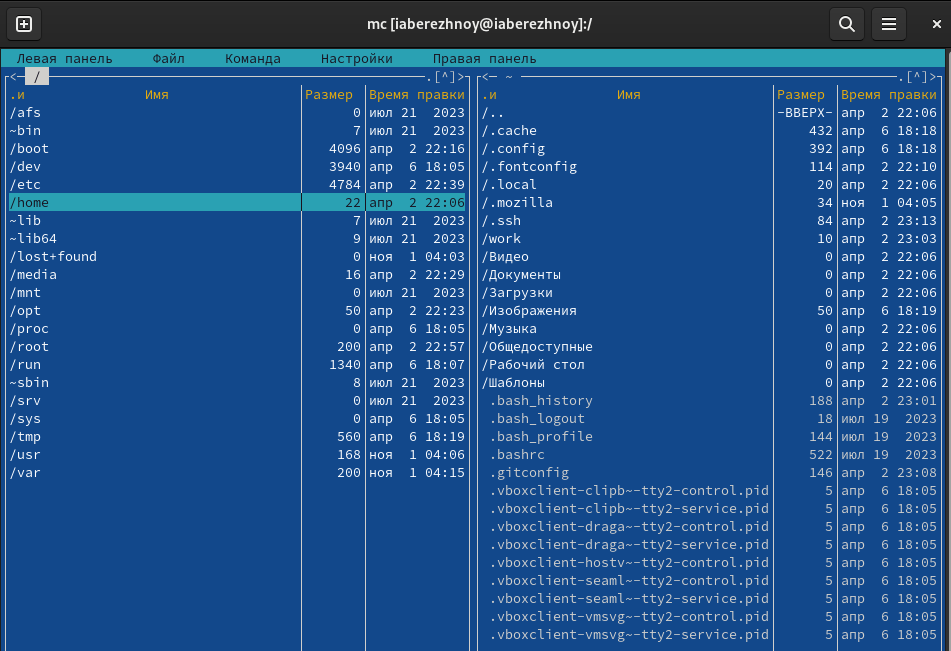{#fig:002 width=70%}

Выполним некоторые команды, используя управляющие клавиши. Начнём с выделения (рис. [-@fig:003]). При выделении мы можем видеть вес файла, также выделенный элемент подсвечивается другим цветом. Само собой, мы можем выделить несколько файлов одновременно (рис. [-@fig:004]). Также мы можем открыть файл для правки (рис. [-@fig:005]), копировать файл (рис. [-@fig:006]) и переместить его (рис. [-@fig:007]).

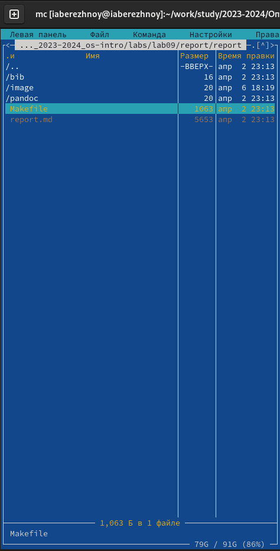{#fig:003 width=70%}

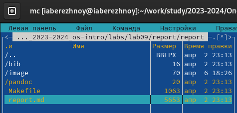{#fig:004 width=70%}

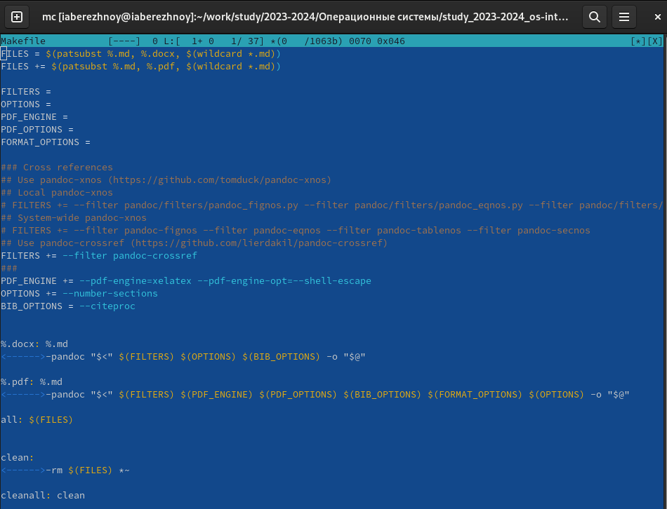{#fig:005 width=70%}

{#fig:006 width=70%}

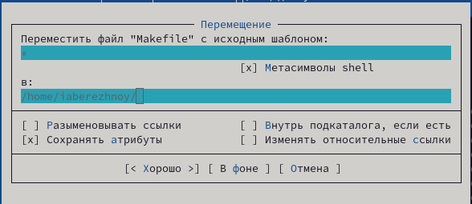{#fig:007 width=70%}

Также мы можем изменить права доступа (рис. [-@fig:008]), создать новый каталог (рис. [-@fig:009]) и т.д.

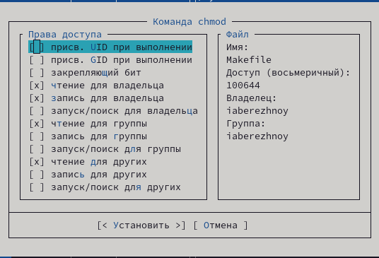{#fig:008 width=70%}

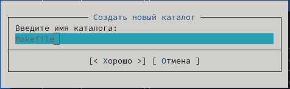{#fig:009 width=70%}

Теперь выполним основные команды меню левой панели. Начнём с "Быстрого просмотра" (рис. [-@fig:010]). Затем посмотрим, что выводит "Информация" (рис. [-@fig:011]) и "Дерево" (рис. [-@fig:012]). Даётся очень подробная информация о файлах, что, вероятно, будет нам очень полезно в будущем.

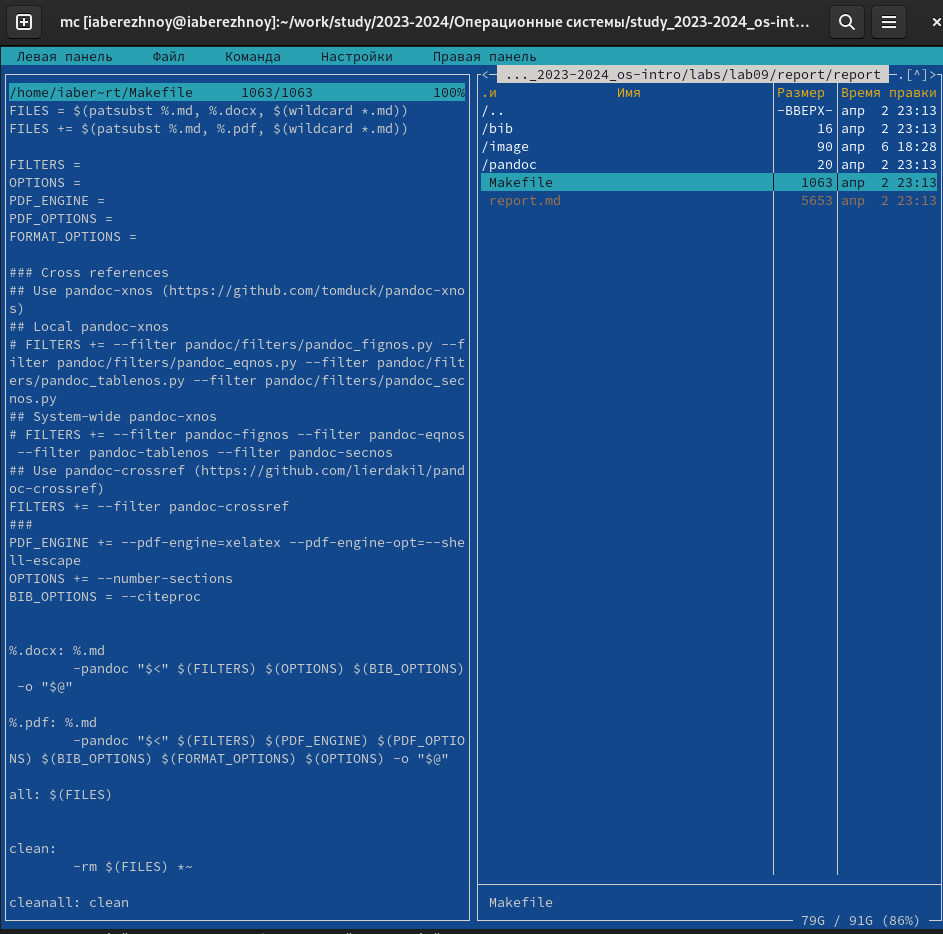{#fig:010 width=70%}

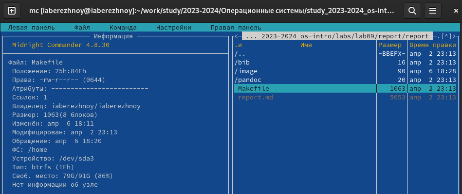{#fig:011 width=70%}

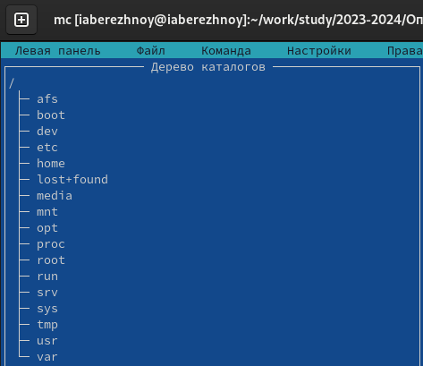{#fig:012 width=70%}

Теперь, с помощью подменю "Файл", выполним просмотр файла report.md (рис. [-@fig:013]), редактируем его содержимое без сохранения (рис. [-@fig:014]), создадим каталог New (рис. [-@fig:015]) и копируем в него файл (рис. [-@fig:016]).

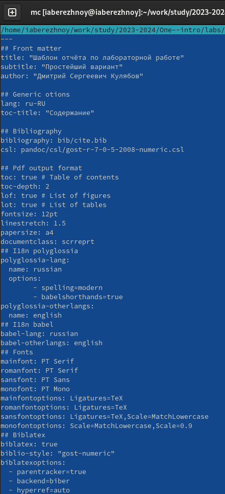{#fig:013 width=70%}

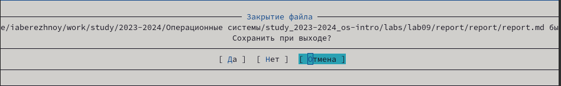{#fig:014 width=70%}

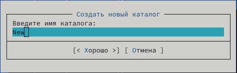{#fig:015 width=70%}

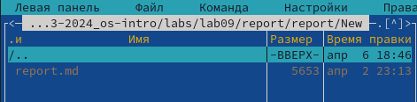{#fig:016 width=70%}

Найдём в системе файл с заданными условиями с помощью подменю "Команда" (рис. [-@fig:017]). Зайдём в историю командной строки и повторим одну из команд, выбрав её в истории (рис. [-@fig:018]). Перейдём в домашний каталог через дерево каталогов (рис. [-@fig:019]) и проанализируем файл расширений (рис. [-@fig:020]) и файл меню (рис. [-@fig:021]).

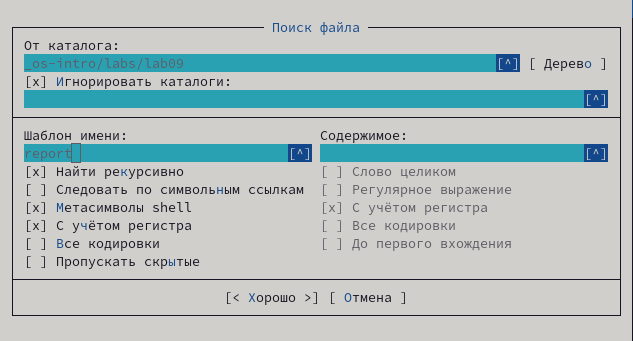{#fig:017 width=70%}

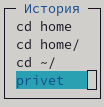{#fig:018 width=70%}

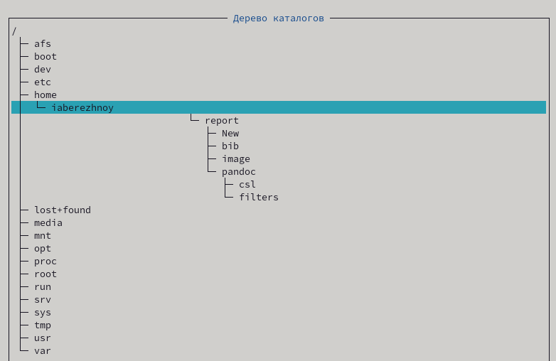{#fig:019 width=70%}

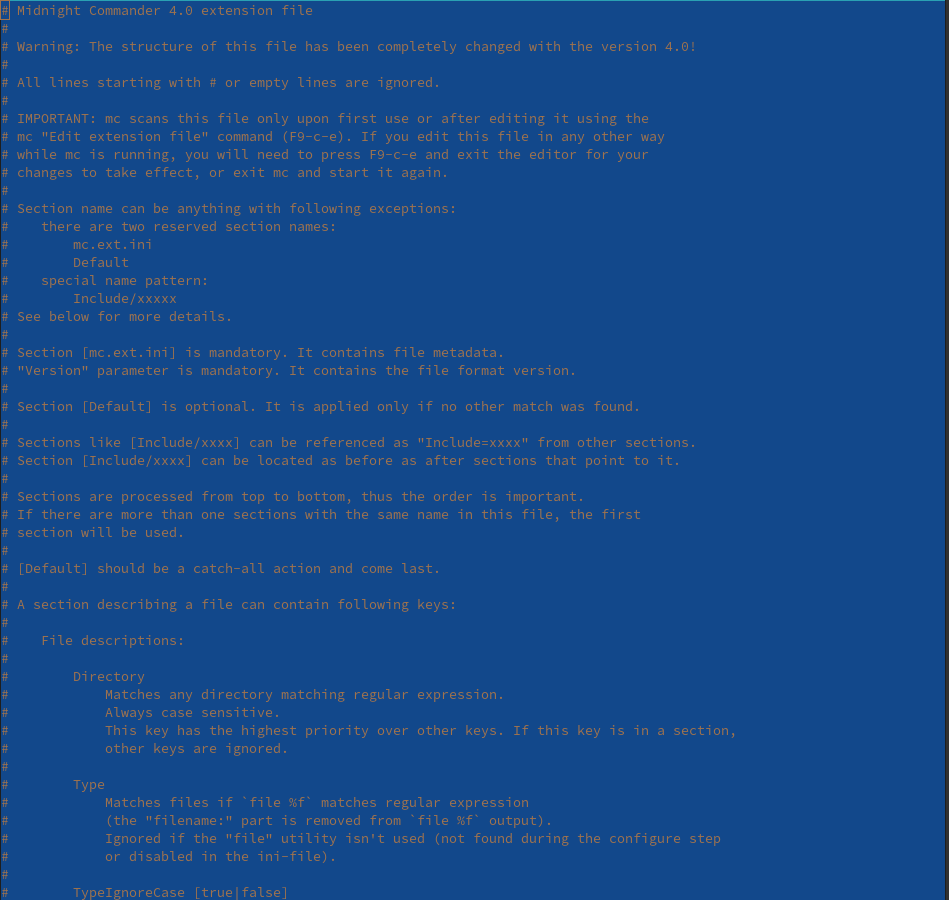{#fig:020 width=70%}

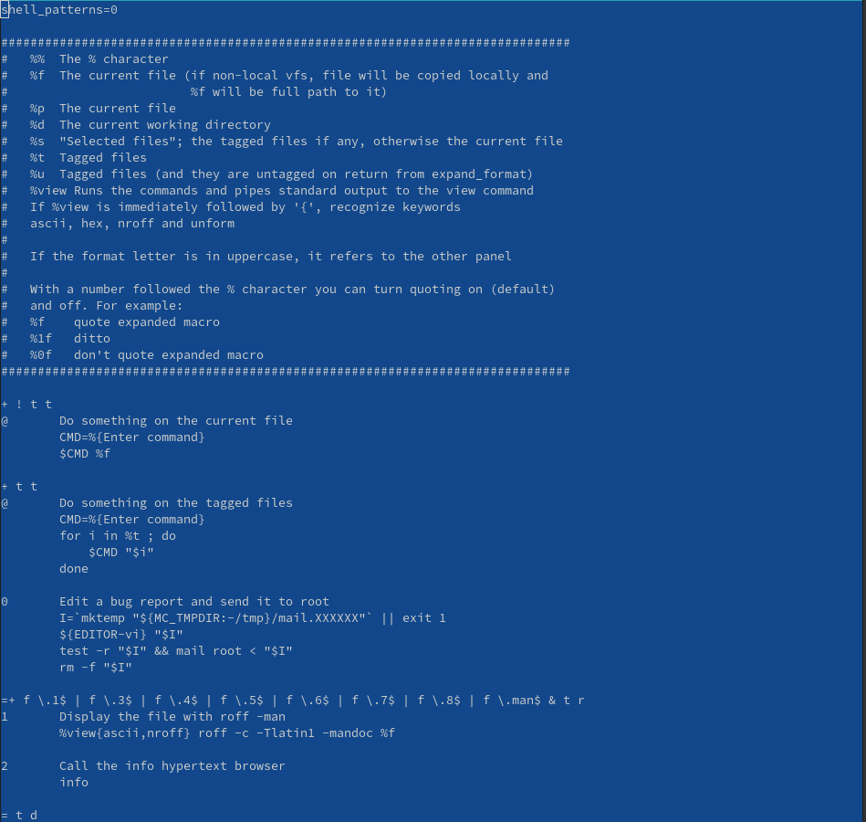{#fig:021 width=70%}

Зайдём в меню Настройки, посмотрим "Параметры конфигурации" (рис. [-@fig:022]), затем "Внешний вид" (рис. [-@fig:023]), "Настройки панели" (рис. [-@fig:024]) и "Подтверждение" (рис. [-@fig:025]).

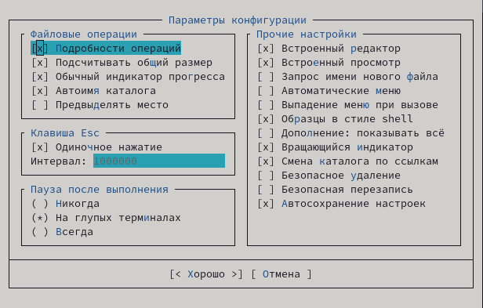{#fig:022 width=70%}

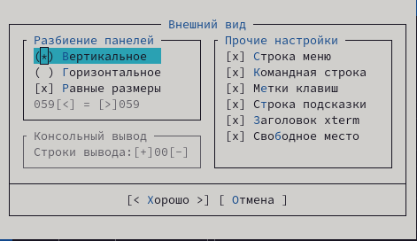{#fig:023 width=70%}

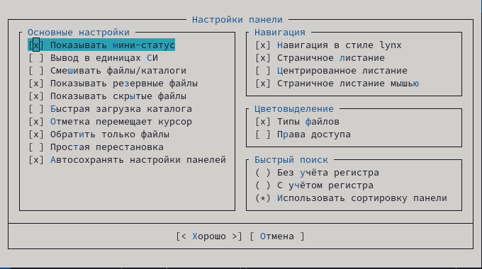{#fig:024 width=70%}

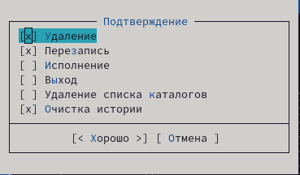{#fig:025 width=70%}

## Практика по встроенному редактору mc
Создадим файл text.txt (рис. [-@fig:026]) и откроем его с помощью встроенного в mc редактора (рис. [-@fig:027]).

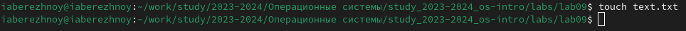{#fig:026 width=70%}

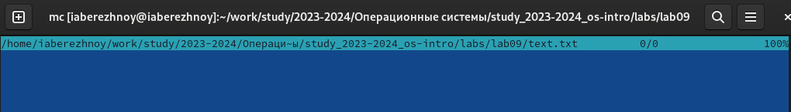{#fig:027 width=70%}

Вставим небольшой фрагмент текста в этот файл (рис. [-@fig:028]) и начнём практиковаться.

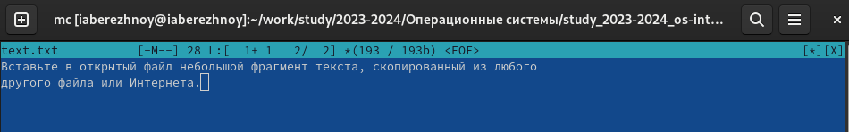{#fig:028 width=70%}

Для начала выделим вторую строчку и удалим её комбинацией клавиш Win+F8 (рис. [-@fig:029]), затем скопируем первую строку на следующую клавишами Win+F5 (рис. [-@fig:030]). Теперь выделим первую строку и перенесём её на другую клавишами Win+F6 (рис. [-@fig:031]) и сохраним файл Win+F2 (рис. [-@fig:032]).

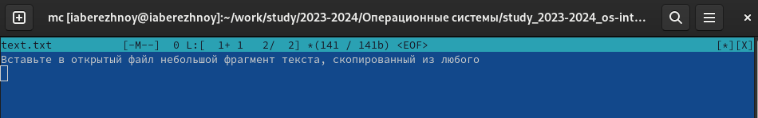{#fig:029 width=70%}

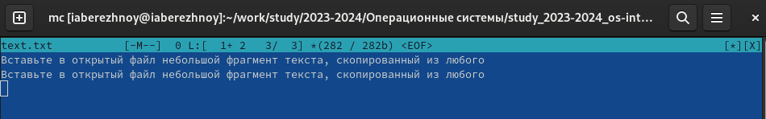{#fig:030 width=70%}

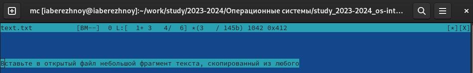{#fig:031 width=70%}

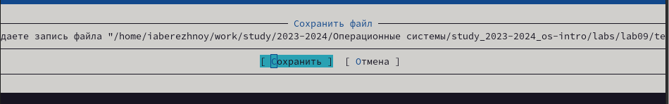{#fig:032 width=70%}

Отменим последнее действие (рис. [-@fig:033]), перейдём в конец файла и напишем там "Text1" (рис. [-@fig:034]), перейдём в начало и напишем "Text2" (рис. [-@fig:035]). 

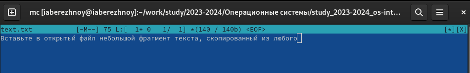{#fig:033 width=70%}

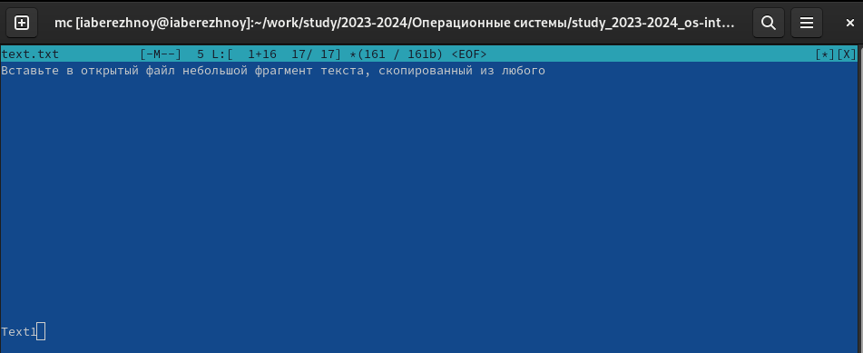{#fig:034 width=70%}

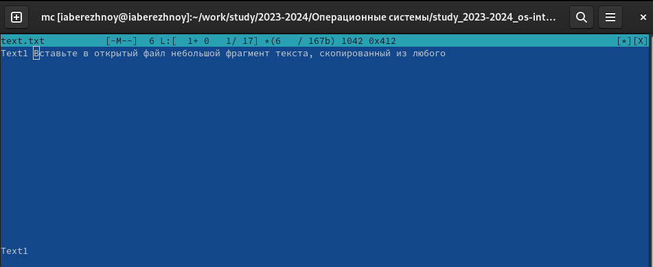{#fig:035 width=70%}

Откроем файл на языке Python (рис. [-@fig:036]) и выключим подсветку синтаксиса (рис. [-@fig:037]).

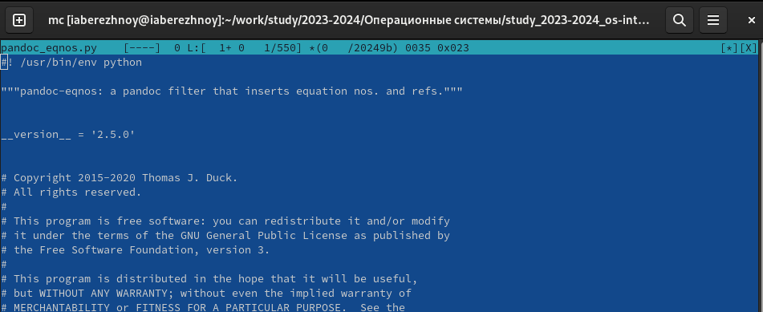{#fig:036 width=70%}

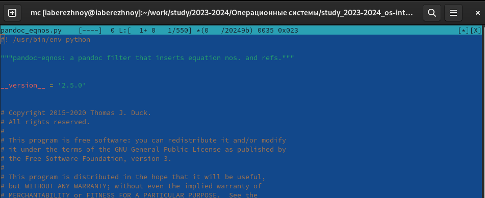{#fig:037 width=70%}

# Выводы

В ходе выполнения лабораторной работы мы освоили основные возможности командной оболочки Midnight Commander, приобрели навыки практической работы по просмотру каталогов и файлов; манипуляций с ними.

# Список литературы{.unnumbered}
