---
## Front matter
title: "Отчёт по лабораторной работе №11"
subtitle: "Операционные системы"
author: "Бережной Иван Александрович"

## Generic otions
lang: ru-RU
toc-title: "Содержание"

## Bibliography
bibliography: bib/cite.bib
csl: pandoc/csl/gost-r-7-0-5-2008-numeric.csl

## Pdf output format
toc: true # Table of contents
toc-depth: 2
lof: true # List of figures
lot: true # List of tables
fontsize: 13pt
linestretch: 1.5
papersize: a4
documentclass: scrreprt
## I18n polyglossia
polyglossia-lang:
  name: russian
  options:
	- spelling=modern
	- babelshorthands=true
polyglossia-otherlangs:
  name: english
## I18n babel
babel-lang: russian
babel-otherlangs: english
## Fonts
mainfont: PT Serif
romanfont: PT Serif
sansfont: PT Sans
monofont: PT Mono
mainfontoptions: Ligatures=TeX
romanfontoptions: Ligatures=TeX
sansfontoptions: Ligatures=TeX,Scale=MatchLowercase
monofontoptions: Scale=MatchLowercase,Scale=0.9
## Biblatex
biblatex: true
biblio-style: "gost-numeric"
biblatexoptions:
  - parentracker=true
  - backend=biber
  - hyperref=auto
  - language=auto
  - autolang=other*
  - citestyle=gost-numeric
## Pandoc-crossref LaTeX customization
figureTitle: "Рис."
tableTitle: "Таблица"
listingTitle: "Листинг"
lofTitle: "Список иллюстраций"
lotTitle: "Список таблиц"
lolTitle: "Листинги"
## Misc options
indent: true
header-includes:
  - \usepackage{indentfirst}
  - \usepackage{float} # keep figures where there are in the text
  - \floatplacement{figure}{H} # keep figures where there are in the text
---

# Цель работы

Познакомиться с операционной системой Linux. Получить практические навыки работы с редактором Emacs.

# Задание

1. Выполнить операции с файлом и текстом
2. Разобраться, как управлять буферами
3. Научиться управлять окнами

# Теоретическое введение

Определение 1. Буфер — объект, представляющий какой-либо текст.
Буфер может содержать что угодно, например, результаты компиляции программы или встроенные подсказки. Практически всё взаимодействие с пользователем, в том числе интерактивное, происходит посредством буферов.
Определение 2. Фрейм соответствует окну в обычном понимании этого слова. Каждый фрейм содержит область вывода и одно или несколько окон Emacs.
Определение 3. Окно — прямоугольная область фрейма, отображающая один из буфе-
ров.
Каждое окно имеет свою строку состояния, в которой выводится следующая информация: название буфера, его основной режим, изменялся ли текст буфера и как далеко вниз по буферу расположен курсор. Каждый буфер находится только в одном из возможных основных режимов. Существующие основные режимы включают режим Fundamental (наименее специализированный), режим Text, режим Lisp, режим С, режим Texinfo и другие. Под второстепенными режимами понимается список режимов, которые включены в данный момент в буфере выбранного окна.

# Выполнение лабораторной работы

## Выполнение операций с файлом и редактирование текста
Откроем emacs и создадим файл lab07.sh с помощью горячих клавиш (рис. [-@fig:001]). Теперь скопируем туда предложенный текст (рис. [-@fig:002]).

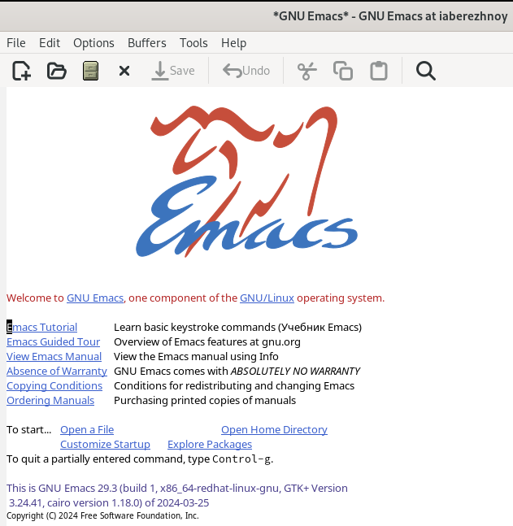{#fig:001 width=70%}

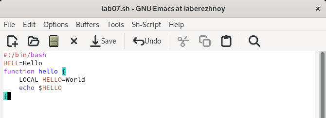{#fig:002 width=70%}

Сохраним файл, используя комбинации клавиш и проделаем манипуляции с текстом: вырежем строку и вставим в конец файла, выделим область текста и скопируем её в буфер обмена, вставим область в конец файла, снова выделим её и вырежем, и, наконец, отменим последнее действие. Вот, что в итоге получилось (рис. [-@fig:003]). Также поперемещаем курсор с помощью клавиш.

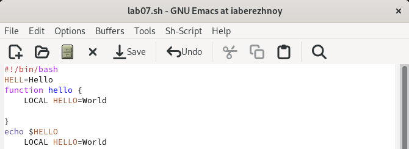{#fig:003 width=70%}

## Управление буферами
Выведем список активных буферов на экран (рис. [-@fig:004]), переместимся в это окно и переключимся на другой буфер (рис. [-@fig:005]). Теперь закроем это окно и переключимся между буферами без вывода их списка на экран (рис. [-@fig:006]).

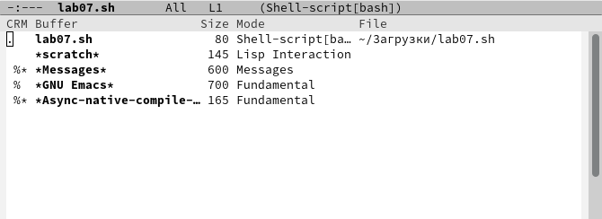{#fig:004 width=70%}

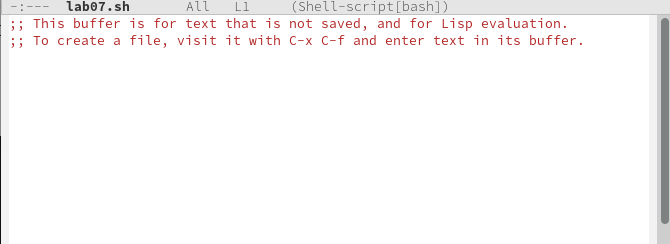{#fig:005 width=70%}

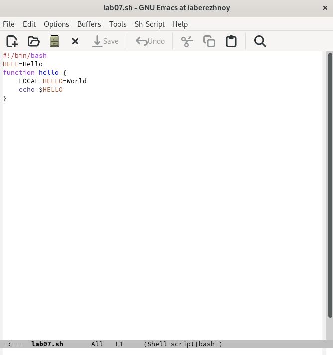{#fig:006 width=70%}

## Управление окнами
Поделим окно на 4 части (рис. [-@fig:007]), в каждом из которых откроем новый буфер. Введём в каждом несколько строк текста (рис. [-@fig:008]).

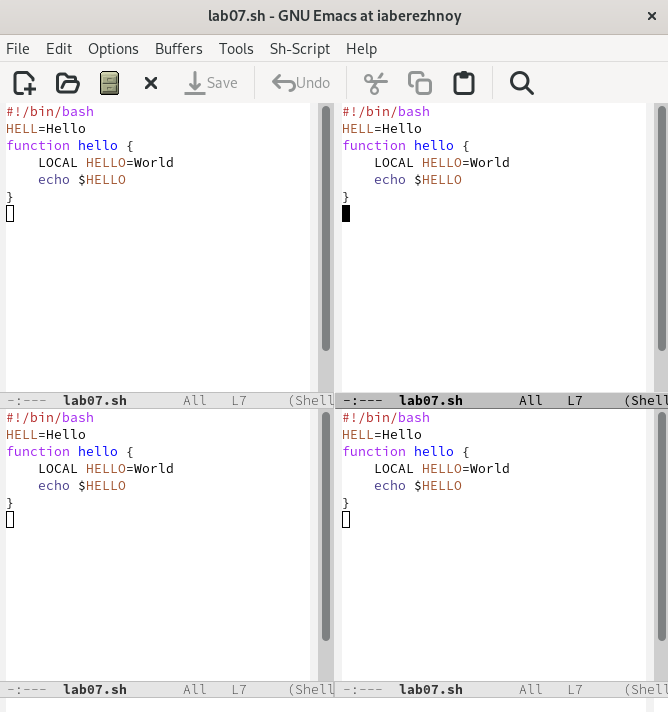{#fig:007 width=70%}

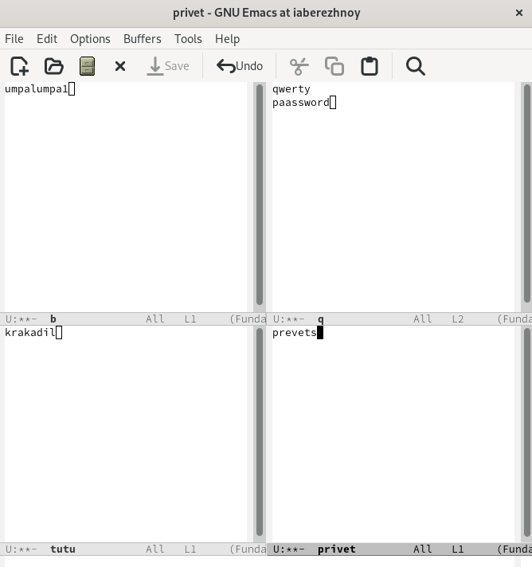{#fig:008 width=70%}

Переключимся в режим поиска и найдём слово "um", присутствующее в первом буфере (рис. [-@fig:009]) и выйдем из режима поиска.

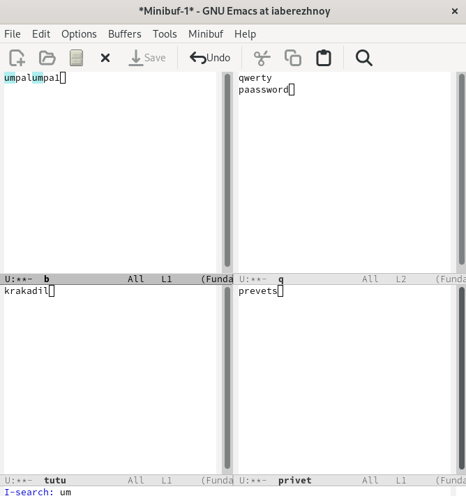{#fig:009 width=70%}

Перейдём в режим поиска и замены (рис. [-@fig:010]). Введём текст, который хотим заменить, нажмём Enter и напишем текст, на который хотим заменить. Попробуем другой режим поиска (рис. [-@fig:011]).

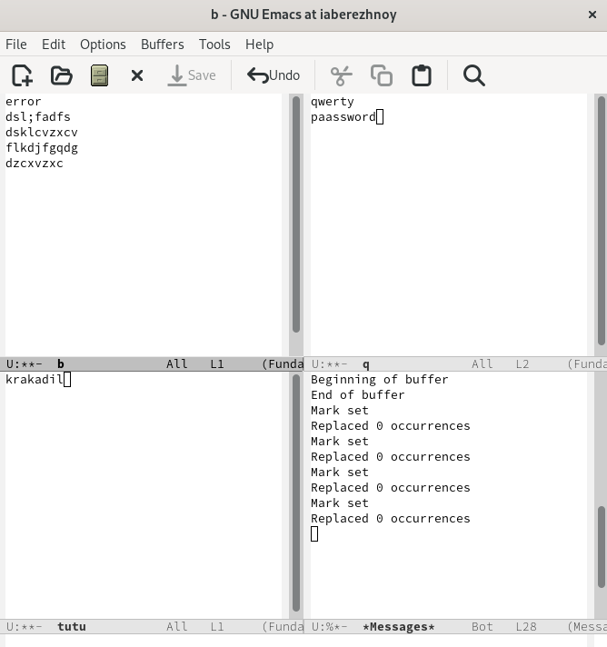{#fig:010 width=70%}

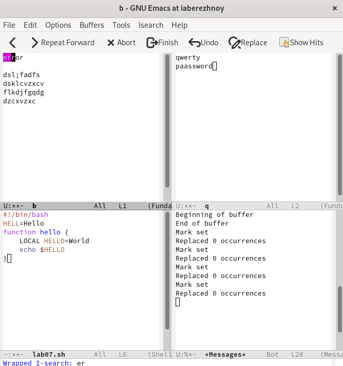{#fig:011 width=70%}

# Выводы

В ходе выполнения лабораторной работы мы познакомились с редактором emacs и получили практические навыки в работе с ним.

# Список литературы{.unnumbered}
