---
## Front matter
title: "Отчёт по лабораторной работе №12"
subtitle: "Операционные системы"
author: "Бережной Иван Александрович"

## Generic otions
lang: ru-RU
toc-title: "Содержание"

## Bibliography
bibliography: bib/cite.bib
csl: pandoc/csl/gost-r-7-0-5-2008-numeric.csl

## Pdf output format
toc: true # Table of contents
toc-depth: 2
lof: true # List of figures
lot: true # List of tables
fontsize: 13pt
linestretch: 1.5
papersize: a4
documentclass: scrreprt
## I18n polyglossia
polyglossia-lang:
  name: russian
  options:
	- spelling=modern
	- babelshorthands=true
polyglossia-otherlangs:
  name: english
## I18n babel
babel-lang: russian
babel-otherlangs: english
## Fonts
mainfont: PT Serif
romanfont: PT Serif
sansfont: PT Sans
monofont: PT Mono
mainfontoptions: Ligatures=TeX
romanfontoptions: Ligatures=TeX
sansfontoptions: Ligatures=TeX,Scale=MatchLowercase
monofontoptions: Scale=MatchLowercase,Scale=0.9
## Biblatex
biblatex: true
biblio-style: "gost-numeric"
biblatexoptions:
  - parentracker=true
  - backend=biber
  - hyperref=auto
  - language=auto
  - autolang=other*
  - citestyle=gost-numeric
## Pandoc-crossref LaTeX customization
figureTitle: "Рис."
tableTitle: "Таблица"
listingTitle: "Листинг"
lofTitle: "Список иллюстраций"
lotTitle: "Список таблиц"
lolTitle: "Листинги"
## Misc options
indent: true
header-includes:
  - \usepackage{indentfirst}
  - \usepackage{float} # keep figures where there are in the text
  - \floatplacement{figure}{H} # keep figures where there are in the text
---

# Цель работы

Изучить основы программирования в оболочке ОС UNIX/Linux. Научиться писать небольшие командные файлы.

# Задание

1. Написать скрипт, создающий резервную копию самого себя
2. Написать командный файл, выводящий в терминал введённые строки
3. Написать аналог команды ls
4. Написать командный файл, вычисляющий количество файлов с указанным расширением

# Теоретическое введение

Командный процессор (командная оболочка, интерпретатор команд shell) — это программа, позволяющая пользователю взаимодействовать с операционной системой компьютера. В операционных системах типа UNIX/Linux наиболее часто используются следующие реализации командных оболочек:
– оболочка Борна (Bourne shell или sh) — стандартная командная оболочка UNIX/Linux, содержащая базовый, но при этом полный набор функций;
– С-оболочка (или csh) — надстройка на оболочкой Борна, использующая С-подобный синтаксис команд с возможностью сохранения истории выполнения команд;
– оболочка Корна (или ksh) — напоминает оболочку С, но операторы управления программой совместимы с операторами оболочки Борна;
– BASH — сокращение от Bourne Again Shell (опять оболочка Борна), в основе своей совмещает свойства оболочек С и Корна (разработка компании Free Software Foundation).
POSIX (Portable Operating System Interface for Computer Environments) — набор стандартов описания интерфейсов взаимодействия операционной системы и прикладных программ.
Стандарты POSIX разработаны комитетом IEEE (Institute of Electrical and Electronics Engineers) для обеспечения совместимости различных UNIX/Linux-подобных операционных систем и переносимости прикладных программ на уровне исходного кода. POSIX-совместимые оболочки разработаны на базе оболочки Корна.

# Выполнение лабораторной работы

## Написание скрипта, создающего резервную копию самого себя
Для начала создадим файл и дадим ему разрешение на исполнение (рис. [-@fig:001]). Откроем его и пропишем логику выполнения (рис. [-@fig:002]). В результате выполнения мы получим архив с копией нужного нам файла.

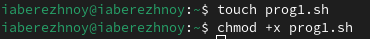{#fig:001 width=70%}

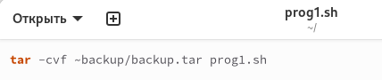{#fig:002 width=70%}

## Написание командного файла, выводящего в терминал введённые строки
Создадим новый файл (рис. [-@fig:003]) и напишем скрипт (рис. [-@fig:004]) - цикл, который проходит по каждому введённому значению и выводит его на экран (рис. [-@fig:005]).

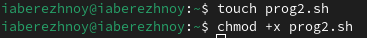{#fig:003 width=70%}

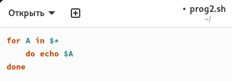{#fig:004 width=70%}

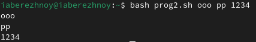{#fig:005 width=70%}

## Написание аналога команды ls
Снова создаём файл (рис. [-@fig:006]) и пишем в нём скрипт (рис. [-@fig:007]), который будет давать информацию о нужном каталоге и выводить информацию о возможностях доступа к его файлам (рис. [-@fig:008]).

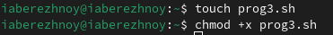{#fig:006 width=70%}

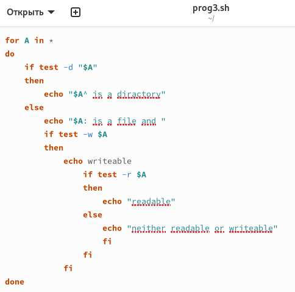{#fig:007 width=70%}

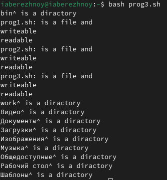{#fig:008 width=70%}

## Написание командного файла, вычисляющего количество файлов с указанным расширением
Создадим последний на сегодня файл (рис. [-@fig:009]) и напишем логику (рис. [-@fig:010]). Он будет вычислять количество файлов с указанным расширением внутри указанного каталога (рис. [-@fig:011]).

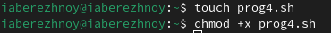{#fig:009 width=70%}

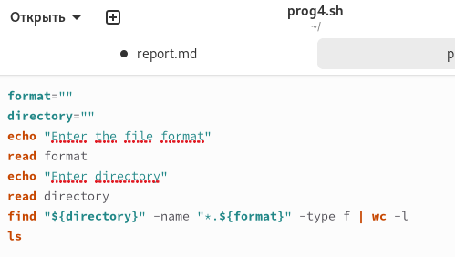{#fig:010 width=70%}

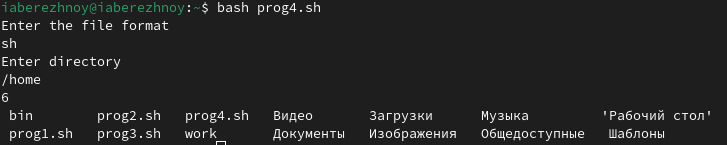{#fig:011 width=70%}

# Выводы

В ходе выполнения лабораторной работы мы изучили основы программирования в оболочке ОС UNIX/Linux и научились писать небольшие командные файлы.

# Список литературы{.unnumbered}
