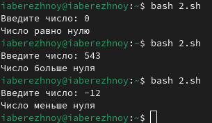

---
## Front matter
title: "Отчёт по лабораторной работе №13"
subtitle: "Операционные системы"
author: "Бережной Иван Александрович"

## Generic otions
lang: ru-RU
toc-title: "Содержание"

## Bibliography
bibliography: bib/cite.bib
csl: pandoc/csl/gost-r-7-0-5-2008-numeric.csl

## Pdf output format
toc: true # Table of contents
toc-depth: 2
lof: true # List of figures
lot: true # List of tables
fontsize: 13pt
linestretch: 1.5
papersize: a4
documentclass: scrreprt
## I18n polyglossia
polyglossia-lang:
  name: russian
  options:
	- spelling=modern
	- babelshorthands=true
polyglossia-otherlangs:
  name: english
## I18n babel
babel-lang: russian
babel-otherlangs: english
## Fonts
mainfont: PT Serif
romanfont: PT Serif
sansfont: PT Sans
monofont: PT Mono
mainfontoptions: Ligatures=TeX
romanfontoptions: Ligatures=TeX
sansfontoptions: Ligatures=TeX,Scale=MatchLowercase
monofontoptions: Scale=MatchLowercase,Scale=0.9
## Biblatex
biblatex: true
biblio-style: "gost-numeric"
biblatexoptions:
  - parentracker=true
  - backend=biber
  - hyperref=auto
  - language=auto
  - autolang=other*
  - citestyle=gost-numeric
## Pandoc-crossref LaTeX customization
figureTitle: "Рис."
tableTitle: "Таблица"
listingTitle: "Листинг"
lofTitle: "Список иллюстраций"
lotTitle: "Список таблиц"
lolTitle: "Листинги"
## Misc options
indent: true
header-includes:
  - \usepackage{indentfirst}
  - \usepackage{float} # keep figures where there are in the text
  - \floatplacement{figure}{H} # keep figures where there are in the text
---

# Цель работы

Изучить основы программирования в оболочке ОС UNIX. Научится писать более сложные командные файлы с использованием логических управляющих конструкций и циклов.

# Задание

1. Написать командный файл, ищущий нужные строки
2. Написать программу на языке Си, определяющую, какое число было введено, и командный файл, вызывающий эту программу
3. Написать командный файл, создающий указанное количество файлов, пронумерованных последовательно от 1 до N
4. Написать командный файл, который сжимаем указанные файлы в архив

# Выполнение лабораторной работы

## Написание первого командного файла
Создадим файл в терминале и присвоим ему право на исполнение. Напишем скрипт, который анализирует командную строку с ключами и ищет в указанном файле нужные строки, определённые после ключа `-p` (рис. [-@fig:001]). Создадим текстовый файл, в котором будем искать строки (рис. [-@fig:002]). Запустим скрипт (рис. [-@fig:003]) и получим вот такой результат (рис. [-@fig:004]).

{#fig:001 width=70%}

{#fig:002 width=70%}

{#fig:003 width=70%}

{#fig:004 width=70%}

## Написание второго командного файла и программы на Си
Создадим второй командный файл и файл с расширением `.c`. В последнем напишем команду, которая будет проверять, является ли число положительным, отрицательным или нулём (рис. [-@fig:005]). Напишем скрипт, который будет вызывать этот файл и выводить в терминал результат в виде текста (рис. [-@fig:006]). Проверим работу файлов (рис. [-@fig:007]).

{#fig:005 width=70%}

{#fig:006 width=70%}

{#fig:007 width=70%}

## Написание третьего командного файла
Теперь напишем командный файл, создающий указанное число файлов, пронумерованных последовательно от 1 до N, при этом количество файлов будет передаваться в аргументы командной строки (рис. [-@fig:008]). Проверим, работает ли скрипт (рис. [-@fig:009]).

{#fig:008 width=70%}

{#fig:009 width=70%}

## Написание четвёртого командного файла
И, наконец, напишем командный файл, который с помощью команды tar запаковывает в архив все файлы в указанной директории (рис. [-@fig:010]). Запустим скрипт через командную строку (рис. [-@fig:011]).

{#fig:010 width=70%}

{#fig:011 width=70%}

# Выводы

В ходе выполнения лабораторной работы мы изучили основы программирования в оболочке ОС UNIX и научились писать более сложные командные файлы с использованием логических управляющих конструкций и циклов.

# Список литературы{.unnumbered}
