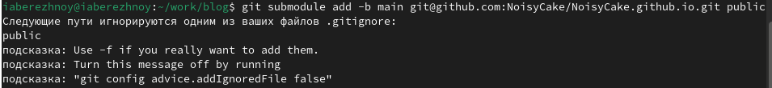

---
## Front matter
title: "Отчёт по первому этапу индивидуального проекта"
subtitle: "Операционные системы"
author: "Бережной Иван Александрович"

## Generic otions
lang: ru-RU
toc-title: "Содержание"

## Bibliography
bibliography: bib/cite.bib
csl: pandoc/csl/gost-r-7-0-5-2008-numeric.csl

## Pdf output format
toc: true # Table of contents
toc-depth: 2
lof: true # List of figures
lot: true # List of tables
fontsize: 13pt
linestretch: 1.5
papersize: a4
documentclass: scrreprt
## I18n polyglossia
polyglossia-lang:
  name: russian
  options:
	- spelling=modern
	- babelshorthands=true
polyglossia-otherlangs:
  name: english
## I18n babel
babel-lang: russian
babel-otherlangs: english
## Fonts
mainfont: PT Serif
romanfont: PT Serif
sansfont: PT Sans
monofont: PT Mono
mainfontoptions: Ligatures=TeX
romanfontoptions: Ligatures=TeX
sansfontoptions: Ligatures=TeX,Scale=MatchLowercase
monofontoptions: Scale=MatchLowercase,Scale=0.9
## Biblatex
biblatex: true
biblio-style: "gost-numeric"
biblatexoptions:
  - parentracker=true
  - backend=biber
  - hyperref=auto
  - language=auto
  - autolang=other*
  - citestyle=gost-numeric
## Pandoc-crossref LaTeX customization
figureTitle: "Рис."
tableTitle: "Таблица"
listingTitle: "Листинг"
lofTitle: "Список иллюстраций"
lotTitle: "Список таблиц"
lolTitle: "Листинги"
## Misc options
indent: true
header-includes:
  - \usepackage{indentfirst}
  - \usepackage{float} # keep figures where there are in the text
  - \floatplacement{figure}{H} # keep figures where there are in the text
---

# Цель работы

Познакомиться с генератором статических сайтов Hugo, научиться размещать сайты на Github Pages

# Задание

1. Установить необходимое программное обеспечение.
2. Скачать шаблон темы сайта.
3. Разместить его на хостинге git.
4. Установить параметр для URLs сайта.
5. Разместить заготовку сайта на Github pages.

# Выполнение лабораторной работы

Для начала скачаем архив hugo_extended, который нужен нам для создания сайта (рис. [-@fig:001]) и переместим исполняемый файл в каталог bin (рис. [-@fig:002]).

{#fig:001 width=70%}

{#fig:002 width=70%}

Возьмём шаблон репозитория и создадим на его основе свой (рис. [-@fig:003]). В нём будет находиться наш проект-блог.

{#fig:003 width=70%}

Теперь клонируем этот репозиторий локально, чтобы работать с ним в виртуальной машине (рис. [-@fig:004]).

{#fig:004 width=70%}

Запускаем локальный сервер hugo (рис. [-@fig:005]) и переходим на сайт по выведенной в консоль ссылке (рис. [-@fig:006]).

{#fig:005 width=70%}

{#fig:006 width=70%}

Теперь создадим репозиторий со специальным названием `NoisyCake.guthub.io` (рис. [-@fig:007]). Клонируем его в папку work (рис. [-@fig:008]).

{#fig:007 width=70%}

{#fig:008 width=70%}

Перейдём в новый репозиторий и переключимся на ветку main. Создадим файл README.md и сохраним изменения на Github (рис. [-@fig:009]).

{#fig:009 width=70%}

Подключим новый репозиторий к папке public внутри репозитория blog. Для этого воспользуемся командой `git submodule add -b main link` (рис. [-@fig:010]). Как видим, папка public игнорируется при коммитах, что нам не нужно, поэтому мы редактируем файл .gitignore, закомментировав в нём строку "public" (рис. [-@fig:011]). Повторяем команду (рис. [-@fig:012]).

{#fig:010 width=70%}

{#fig:011 width=70%}

{#fig:012 width=70%}

Вновь запускаем сервер командой `hugo`. Теперь у нас появились нужные файлы в папке public. Сохраняем изменения на Github (рис. [-@fig:013]). Теперь мы можем заходить на сайт по ссылке, содержащей название последнего репозитория (NoisyCake.github.io) (рис. [-@fig:014]).

{#fig:013 width=70%}

{#fig:014 width=70%}

# Выводы

В ходе выполнения лабораторной работы мы научились размещать сайты на Github Pages и познакомились с генератором статических сайтов Hugo.
