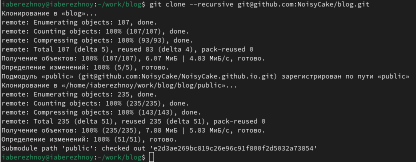

---
## Front matter
lang: ru-RU
title: Презентация к первому этапу индивидуального проекта
subtitle: Операционные системы
author:
  - Бережной И. А., НКАбд-01-23
institute:
  - Российский университет дружбы народов, Москва, Россия

## i18n babel
babel-lang: russian
babel-otherlangs: english

## Formatting pdf
toc: false
toc-title: Содержание
slide_level: 2
aspectratio: 169
section-titles: true
theme: metropolis
header-includes:
 - \metroset{progressbar=frametitle,sectionpage=progressbar,numbering=fraction}
 - '\makeatletter'
 - '\beamer@ignorenonframefalse'
 - '\makeatother'
---

## Актуальность

Программисту может быть полезно уметь создавать сайт-портфолио, чтобы при собеседовании он смог быстро показать свои pet-проекты и наработки.

## Цель работы

Познакомиться с генератором статических сайтов Hugo, научиться размещать сайты на Github Pages.

## Задачи

1. Установить необходимое программное обеспечение
2. Скачать шаблон темы сайта
3. Разместить его на хостинге git
4. Установить параметр для URLs сайта
5. Разместить заготовку сайта на Github pages

## Материалы и методы

- Github
- Hugo
- Github pages
- Git

# Выполнение

Для начала скачаем архив hugo_extended, который нужен нам для создания сайта и переместим исполняемый файл в каталог bin.
Затем возьмём шаблон репозитория и создадим на его основе свой. В нём будет находиться наш проект-блог. Теперь клонируем этот репозиторий локально, чтобы работать с ним в виртуальной машине.

{#fig:004 width=70%}

## Выполнение

Запускаем локальный сервер hugo и переходим на сайт по выведенной в консоль ссылке.

{#fig:006 width=70%}

## Выполнение

Теперь создадим репозиторий со специальным названием `NoisyCake.guthub.io`. Клонируем его в папку work.
Перейдём в новый репозиторий и переключимся на ветку main. Создадим файл README.md и сохраним изменения на Github

Подключим новый репозиторий к папке public внутри репозитория blog. Для этого воспользуемся командой `git submodule add -b main link`. Как видим, папка public игнорируется при коммитах, что нам не нужно, поэтому мы редактируем файл .gitignore, закомментировав в нём строку "public". Повторяем команду.

## Выполнение

Вновь запускаем сервер командой `hugo`. Теперь у нас появились нужные файлы в папке public. Сохраняем изменения на Github. Теперь мы можем заходить на сайт по ссылке, содержащей название последнего репозитория (NoisyCake.github.io).

## Результаты
1. Мы познакомились с генератором статических сайтов Hugo;
2. Мы научились размещать сайты на Github Page.
