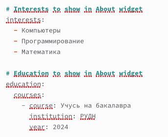

---
## Front matter
title: "Отчёт по второму этапу индивидуального проекта"
subtitle: "Операционные системы"
author: "Бережной Иван Александрович"

## Generic otions
lang: ru-RU
toc-title: "Содержание"

## Bibliography
bibliography: bib/cite.bib
csl: pandoc/csl/gost-r-7-0-5-2008-numeric.csl

## Pdf output format
toc: true # Table of contents
toc-depth: 2
lof: true # List of figures
lot: true # List of tables
fontsize: 13pt
linestretch: 1.5
papersize: a4
documentclass: scrreprt
## I18n polyglossia
polyglossia-lang:
  name: russian
  options:
	- spelling=modern
	- babelshorthands=true
polyglossia-otherlangs:
  name: english
## I18n babel
babel-lang: russian
babel-otherlangs: english
## Fonts
mainfont: PT Serif
romanfont: PT Serif
sansfont: PT Sans
monofont: PT Mono
mainfontoptions: Ligatures=TeX
romanfontoptions: Ligatures=TeX
sansfontoptions: Ligatures=TeX,Scale=MatchLowercase
monofontoptions: Scale=MatchLowercase,Scale=0.9
## Biblatex
biblatex: true
biblio-style: "gost-numeric"
biblatexoptions:
  - parentracker=true
  - backend=biber
  - hyperref=auto
  - language=auto
  - autolang=other*
  - citestyle=gost-numeric
## Pandoc-crossref LaTeX customization
figureTitle: "Рис."
tableTitle: "Таблица"
listingTitle: "Листинг"
lofTitle: "Список иллюстраций"
lotTitle: "Список таблиц"
lolTitle: "Листинги"
## Misc options
indent: true
header-includes:
  - \usepackage{indentfirst}
  - \usepackage{float} # keep figures where there are in the text
  - \floatplacement{figure}{H} # keep figures where there are in the text
---

# Цель работы

Научиться составлять биографию.

# Задание

1. Добавить личные данные
2. Сделать пост по прошедшей неделе
3. Добавить пост на тему "Управление версиями. Git."

# Выполнение лабораторной работы

Для начала перенесём фотографию в общую с хостовой ОС папку, откуда скопируем его в нужный репозиторий (рис. [-@fig:001]). Фотография готова.

{#fig:001 width=70%}\

Теперь добавим биографию и краткую биографию. Так люди смогут понять, с кем имеют дело (рис. [-@fig:002]).

{#fig:002 width=70%}

Теперь напишем свои интересы и место, где обучаемся (рис. [-@fig:003]). Вот, что у нас получилось в итоге (рис. [-@fig:004]).

{#fig:003 width=70%}

{#fig:004 width=70%}

Составим пост о том, как прошла моя неделя (всё же блог ведём) (рис. [-@fig:005]).

{#fig:005 width=70%}

Теперь сделаем пост о git - системе контроля версий, которым мы чуть ли не ежедневно пользуемся (рис. [-@fig:006]).

{#fig:006 width=70%}

Добавим вводный пост и вуаля - готово (рис. [-@fig:007]).

{#fig:007 width=70%}

# Выводы

В ходе выполнения лабораторной работы мы научились составлять биографию и размещать её на сайте.
