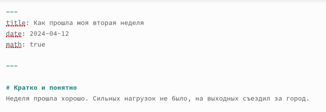

---
## Front matter
lang: ru-RU
title: Презентация ко второму этапу индивидуального проекта
subtitle: Операционные системы
author:
  - Бережной И. А., НКАбд-01-23
institute:
  - Российский университет дружбы народов, Москва, Россия

## i18n babel
babel-lang: russian
babel-otherlangs: english

## Formatting pdf
toc: false
toc-title: Содержание
slide_level: 2
aspectratio: 169
section-titles: true
theme: metropolis
header-includes:
 - \metroset{progressbar=frametitle,sectionpage=progressbar,numbering=fraction}
 - '\makeatletter'
 - '\beamer@ignorenonframefalse'
 - '\makeatother'
---

## Актуальность

Программисту может быть полезно уметь создавать сайт-портфолио, чтобы при собеседовании он смог быстро показать свои pet-проекты и наработки.

## Цель работы

Научиться составлять биографию.

## Задачи

1. Добавить личные данные
2. Сделать пост по прошедшей неделе
3. Добавить пост на тему "Управление версиями. Git."

## Материалы и методы

- Github
- Hugo
- Github pages
- Git

# Выполнение

Сначала нам нужно перенести фотографию в общую с хостовой ОС папку, откуда скопируем его в нужный репозиторий. Теперь добавим биографию и краткую биографию. Теперь напишем свои интересы и место, где обучаемся. Вот, что у нас получилось в итоге получилось

{#fig:001 width=70%}

## Выполнение

Составим пост о том, как прошла моя неделя, после чего сделаем пост о git - системе контроля версий, которым мы чуть ли не ежедневно пользуемся. Добавим вводный пост и вуаля - готово

{#fig:002 width=70%}

## Результаты
1. Мы научились писать автобиографию и размещать её на сайте
2. Мы научились делать посты
