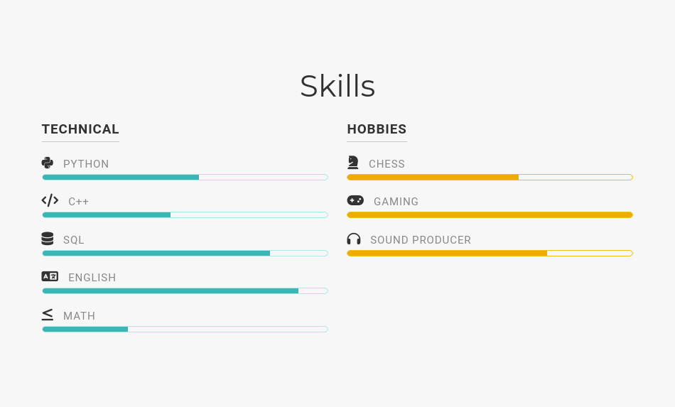
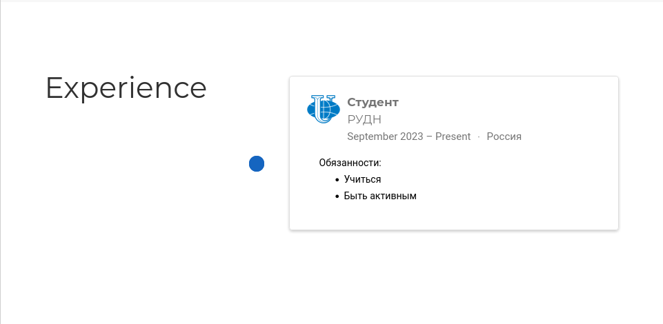
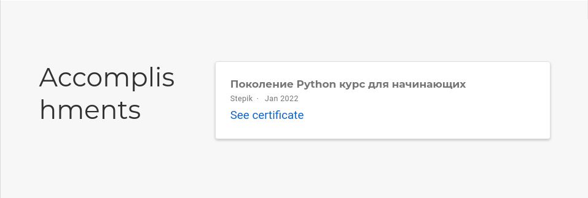

---
## Front matter
lang: ru-RU
title: Презентация к третьему этапу индивидуального проекта
subtitle: Операционные системы
author:
  - Бережной И. А., НКАбд-01-23
institute:
  - Российский университет дружбы народов, Москва, Россия

## i18n babel
babel-lang: russian
babel-otherlangs: english

## Formatting pdf
toc: false
toc-title: Содержание
slide_level: 2
aspectratio: 169
section-titles: true
theme: metropolis
header-includes:
 - \metroset{progressbar=frametitle,sectionpage=progressbar,numbering=fraction}
 - '\makeatletter'
 - '\beamer@ignorenonframefalse'
 - '\makeatother'
---

## Актуальность

Программисту может быть полезно уметь создавать сайт-портфолио, чтобы при собеседовании он смог быстро показать свои pet-проекты и наработки.

## Цель работы

Научиться писать о навыках, достижениях и опыте.

## Задачи

1. Добавить информацию о навыках, опыте и достижениях
2. Сделать пост по прошедшей неделе
3. Добавить пост на тему "Язык разметки Markdown"

## Материалы и методы

- Github
- Hugo
- Github pages
- Git

# Навыки

Сперва укажем свои навыки. Лично мои таковы: программирование на Питоне и Плюсах, составление запросов бд, неплохо владею английским и стараюсь разбираться в математике. Если говорить о хобби, то я играю в шахматы, карты, пишу биты и играю в пк игры.

{#fig:001 width=70%}

## Опыт

Напишем о своём опыте. Я не работал по специальности (которой ещё нет), а только учусь. Поэтому и записал следующее:

{#fig:002 width=70%}

## Достижения

Единственный сертификат, который у меня есть - сертификат Stepik. 

{#fig:002 width=70%}

## Посты

Напишем пару постов. Первый - о том, как я провёл прошедшую неделю, а второй - про язык разметки Markdown. Так как мы их только что написали, они находятся в разделе "Недавние посты".

{#fig:002 width=70%}

## Результаты
1. Мы научились составлять информацию о своих навыках, опыте и достижениях
2. Мы потренировались выкладывать посты
